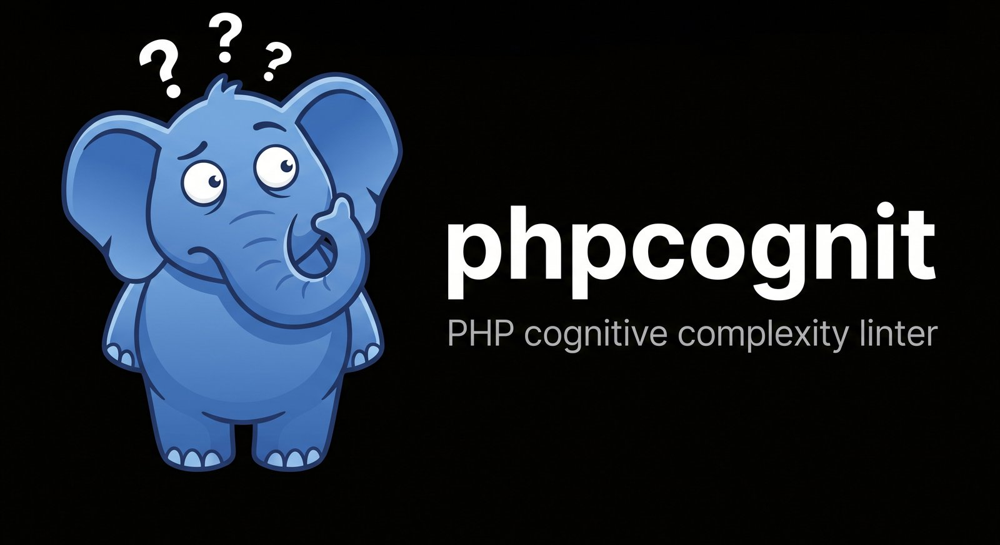

# phpcognit



**Find the PHP that's hard to read — in seconds, across your whole codebase.**

A cognitive complexity linter written in Rust. One static binary, no PHP runtime, no
Composer entry, nothing added to your project. Scans 600,000 lines in **1.5 seconds**.

[](https://github.com/ryckakas/phpcognit/actions/workflows/ci.yml)
[](https://www.npmjs.com/package/phpcognit)
[](https://deps.rs/repo/github/ryckakas/phpcognit)


## Why this one

- **8× faster than the alternatives.** 6,266 files, 613,458 lines, **1.54s**. The
  PHPStan-based option takes 12.77s on the same codebase.
- **Nothing to install into your project.** No `composer require --dev`, no lockfile
  churn, no version conflict with your PHPStan or PHP_CodeSniffer. One pinned binary
  scores PHP 7.x and 8.x alike — ideal for a monorepo running several versions.
- **Never executes your code.** Syntax-only: no autoloader, no reflection. Safe to point
  at third-party or untrusted source.
- **Correct where others aren't.** Three independent implementations agree with
  phpcognit on the specification's worked examples; one lineage doesn't. See
  [Benchmarks](#benchmarks).
- **Adoptable on day one.** Baseline your existing violations and gate on regressions,
  instead of being told to fix 180 functions before you can turn it on.

Cognitive complexity measures how hard code is to *read*, where cyclomatic complexity
measures how hard it is to *test*. A `switch` with twenty arms is cyclomatically awful
and cognitively fine; three nested `if`s are the reverse. The metric is
[SonarSource's](https://www.sonarsource.com/resources/cognitive-complexity/).

## Install

```bash
brew install ryckakas/tap/phpcognit    # macOS and Linux
npx phpcognit --over 15 src/           # or nothing at all
```

<details>
<summary>Windows, npm global, manual download, install script</summary>

```powershell
powershell -ExecutionPolicy Bypass -c "irm https://github.com/ryckakas/phpcognit/releases/latest/download/phpcognit-installer.ps1 | iex"
```

```bash
npm install -g phpcognit
curl --proto '=https' --tlsv1.2 -LsSf https://github.com/ryckakas/phpcognit/releases/latest/download/phpcognit-installer.sh | sh
```

Or take the archive for your platform from
[Releases](https://github.com/ryckakas/phpcognit/releases/latest), check it against the
published SHA-256, and put `phpcognit` on your `PATH`. Builds cover macOS (Apple Silicon
and Intel), Linux (x86-64 and arm64), and Windows (x86-64).

</details>

## Usage

```bash
phpcognit src/                  # fail on anything above 15
phpcognit --over 10 src/        # stricter
phpcognit --all src/            # every function, ranked
phpcognit --format json src/    # for editors and CI
```

```text
  102  src/Checkout/PriceCalculator.php:212  PriceCalculator::applyDiscounts
   68  src/Import/CsvRowMapper.php:88  CsvRowMapper::mapRow
   51  src/Order/OrderRepository.php:344  OrderRepository::syncLineItems
```

Ranked worst-first. A clean run prints nothing and exits 0, so stdout stays usable in a
pipeline. Exit code is 1 on a breach — and also when the scan itself couldn't be
trusted, like an unreadable path or one matching no PHP at all. A gate that silently
passes because a directory got renamed is worse than no gate.

<details>
<summary>JSON shape</summary>

The exit code still reflects the threshold, so a consumer that only wants the data
should read stdout and ignore the exit status.

```json
{
  "threshold": 40,
  "breaches": 1,
  "findings": [
    {
      "path": "src/Checkout/PriceCalculator.php",
      "line": 212,
      "name": "PriceCalculator::applyDiscounts",
      "score": 68
    }
  ]
}
```

</details>

## Benchmarks

Measured over 6,266 files and 613,458 lines of a real production PHP codebase, on an
M-series Mac. Reproduce it yourself with `./benchmark/run.sh`.

### Speed


The PHPStan option is running a semantic engine — types and reflection — so it is doing
more for that time, even with only the complexity rule enabled.

### Correctness

Implementations of this metric disagree with each other. These cases have answers the
specification determines; `a && b && c` scoring one increment and `a && b || c` scoring
two are worked examples from SonarSource's own paper.

| Case | Spec | phpcognit | ncac | Rarst | TomasVotruba¹ |
| --- | --- | --- | --- | --- | --- |
| `if`/`if`/`if` nested | 6 | ✅ 6 | 6 | 6 | 6 |
| `if`/`elseif`/`else` | 3 | ✅ 3 | 3 | 3 | 3 |
| `$a && $b && $c` (one run) | 2 | ✅ **2** | 2 | 2 | ❌ 3 |
| `$a && $b \|\| $c` (two runs) | 3 | ✅ **3** | 3 | 3 | ❌ 2 |
| two sibling `if`s at depth 2 | 9 | ✅ **9** | 9 | 9 | ❌ 7 |

Three implementations built on three different parsers agree. One lineage scores
operator runs backwards and under-counts sibling statements at depth — on one real
method that was the difference between **51 and 27**.

¹ `Artemeon/cognitive-complexity` is a fork of this package — same file tree, same class
names — and returns identical numbers, so the two count as one implementation.

## Adopting on an existing codebase

Any codebase predating the tool has violations — the one benchmarked above had 180.
Nobody refactors 180 functions to adopt a linter, so record them and gate on
regressions:

```bash
phpcognit --write-baseline src/    # records today's findings, exits 0
phpcognit src/                     # fails only on new or worsened functions
```

Commit `.phpcognit-baseline.json`; it's picked up automatically wherever it exists, so
CI, hooks and your terminal agree without repeating flags.

Entries are keyed by function **name, not line**, which matters more than it sounds: a
grandfathered file doesn't become a hiding place. Add a complex new method to an
already-recorded file and it's reported, while the old ones around it stay accepted.

## Suppressing one function

Some code is irreducibly branchy, and regenerating the whole baseline to accept one
deliberate case would re-record every other drift with it. Mark that function instead:

```php
// phpcognit-ignore: dispatch table; splitting it would obscure the mapping
public function dispatch(string $event): void
```

**The reason is mandatory.** A bare `// phpcognit-ignore` is refused, not obeyed — the
finding still reports and stderr says why. Suppression stays a decision someone wrote
down and a reviewer can see.

<details>
<summary>Where the marker may go</summary>

Above the declaration, inside its docblock, or trailing the signature line; attributes
in between are stepped over.

```php
public function dispatch(string $event): void // phpcognit-ignore: flat dispatch table
```

It has to be on the signature. A marker written inside the body is not a suppression, so
one comment can never silence the function it sits in.

Suppression hides a finding; it never changes a score. `--all` still shows the real
number.

</details>

## VS Code

The extension in [`editors/vscode`](editors/vscode) marks functions above the threshold
as you work. It shows exactly what CI would fail on — baselined and suppressed findings
stay hidden, so editor and pipeline never disagree.

## Learn more

- **[Scoring rules](docs/scoring-rules.md)** — the full increment table, boolean-run
  examples, and the PHP-specific cases the specification predates.
- **[Architecture & development](docs/architecture.md)** — source layout, build/lint/test
  commands, and the release process for the CLI and the VS Code extension.

## Licence

MIT
